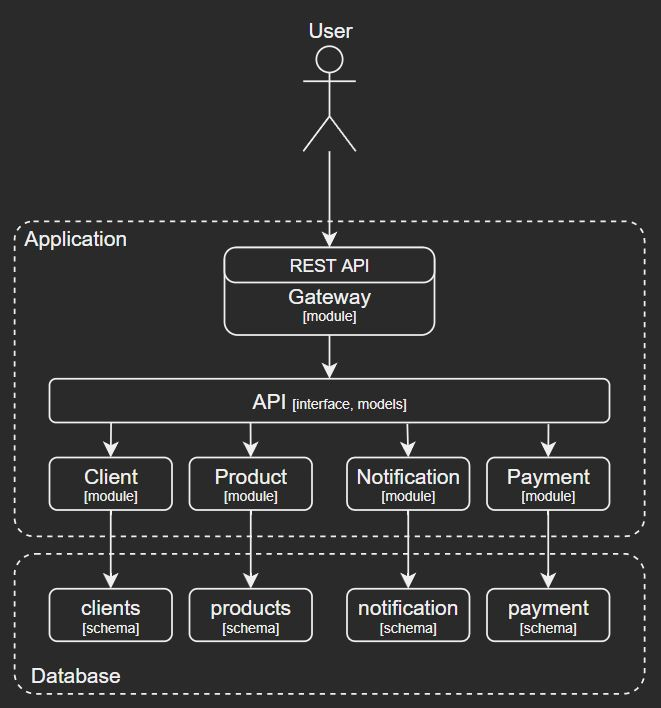

# Online store application

Test description 1

# Architecture

# Inspirations and Recommendations
### Modular monolith
- [[GitHub] Modular Monolith with DDD - K.Grzybek](https://github.com/kgrzybek/modular-monolith-with-ddd)

### Database
- [Advanced Spring Data JPA - Specifications and Querydsl](https://spring.io/blog/2011/04/26/advanced-spring-data-jpa-specifications-and-querydsl)
- [Getting Started with Spring Data Specifications](https://reflectoring.io/spring-data-specifications/)

### Testing
- [JDD2019: Automated tests: You won't find it in a book! [PL] - Jacek Milewski](https://www.youtube.com/watch?v=cQ2BmeqSS9Q&list=PLnKL6-WWWE_Xb-9Rcl250ale3q87ToIK6&index=29)
- [Javeloper 2023: 🧬Testowanie kodu mikroserwisów to bajka. - Jacek Milewski](https://www.youtube.com/watch?v=QdtEWzkMgiI)

### Gradle

### REST API
